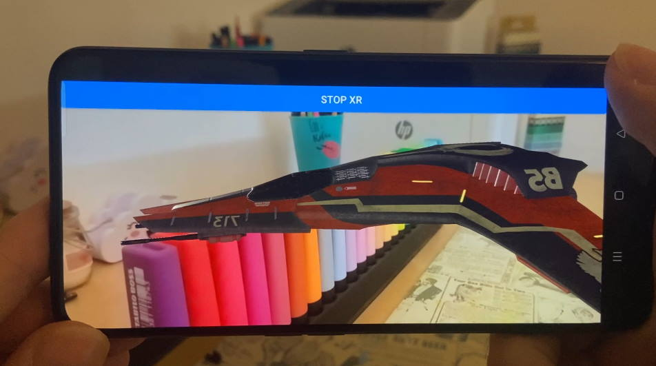

# SpacePiratesAR

This is a sample demo for Android and iOS: Space Pirates with Babylon React-Native and AR.

# Babylon React Native - Getting started with this project

This sample repo is intended to help users getting started using Babylon React Native to create cross-platform applications using BabylonJS. This project can be cloned and used as a starting point or the steps at the end can be used in order to configure a project from scratch. 

- **Required Tools:**
    - [node.js](https://nodejs.org/en/)
    - Android
      - [Android Studio](https://developer.android.com/studio)
    - iOS
      - [Xcode](https://developer.apple.com/xcode/resources/)
      - [cocoapods](https://cocoapods.org/)


## 1. Setup React native development environment

Follow the instructions on React Native's documentation for setting up your development environment. Be sure to select "React Native CLI quickstart" instead of "Expo CLI quickstart" since we currently do not support the usage of Expo. 

- [React Native Environment Setup](https://reactnative.dev/docs/environment-setup)

## 2. Download 

You can download source code archives from [GitHub](https://github.com/SergioRZMasson/BabylonReactNative-GetStarted) or use ```git``` to clone the repository.

```
> git clone https://github.com/BabylonJS/SpacePiratesAR.git
```

## 3. Project setup

From your projects folder restore the npm packages by running:

```
cd SpacePiratesAR
npm install
```

(iOS Only) 

When building for iOS it will also be required to retrieve the pods for the project. Enter the iOS project folder and retreive pods.

```
cd ios
pod install
cd ..
```

(Android Emulator Only)

In order to use Babylon React Native with the Android Emulator it is required that the amulator is configure with GLES3, use the following [instructions on how to set it up properly](docs/ANDROID_EMULATOR.md).


## 4. Try it out

From your projects folder you can now run the following commands to launch your project:

```
npm run ios
npm run android
```

If you want to run the application using your own devices please follow the [React Native Run on Device](https://reactnative.dev/docs/running-on-device) documentation.


## 5. From a blank project to this demo

### 1. Add Permissions for AR
 - In `package.json`, add a new dependency :
 ```
 "react-native-permissions": "^3.0.0"
 ```
For camera access on iOS, add a key in `Info.plist` :

```
...
<dict>
    <key>NSCameraUsageDescription</key>
    <string></string>
    <key>CFBundleDevelopmentRegion</key>
    ...
```

and add permission in the pod file:
```
...
target 'Playground' do
  permissions_path = '../node_modules/react-native-permissions/ios'
  pod 'Permission-Camera', :path => "#{permissions_path}/Camera"
  ...
```

Add Android camera and AR permission in `AndroidManifest.xml` :

```
...
<uses-permission android:name="android.permission.CAMERA"/>
...
```

and 

```
...
</activity>
      <meta-data android:name="com.google.ar.core" android:value="optional" />
    </application>
...
```

### 2. Add Assets to the bundle
 
At the top of `metro.config.js`
```
const defaultAssetExts = require("metro-config/src/defaults/defaults").assetExts
```
And in exports, for glb and jpg:
```
resolver: {
    assetExts: [
        ...defaultAssetExts,
        'glb', 'jpg'
    ]
  }
```
### 3. Loading .glb
An asset Uri has to be resolved by the bundler.
First, add `resolveAssetSource` import in app.tsx
```
import resolveAssetSource from 'react-native/Libraries/Image/resolveAssetSource';
```
Then, to load a glb with Babylon:
```
const sceneGLBUri = resolveAssetSource(require('./assets/myScene.glb')).uri;
SceneLoader.AppendAsync("", sceneGLBUri, scene).then(() => {
  ...
```
### 4. Loading .json
`require` will find, load and parse the json. Depending on the API used, it might be interesting to convert it back to a string.
In this project, JSON are used for loading NME shaders. It can be done this way:
```
const starsShader = require('./assets/starfieldShader.json');
var starsShaderMaterial = new NodeMaterial("starsShader", scene);
starsShaderMaterial.loadFromSerialization(starsShader, "");
starsShaderMaterial.build();
```

## More information

[How to create this project from scratch](CREATE.md)

Additional Documentation
------------------------

* [Babylon React Native](https://github.com/BabylonJS/BabylonReactNative)
